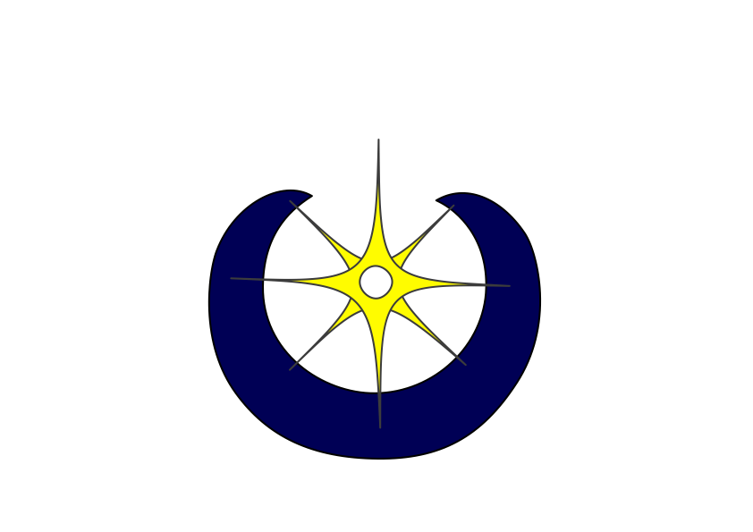

# Tsunamicollege
[Tsunamicollege.com](http://www.tsunamicollege.com) is a new Project that wants to provide a no-stress online learning plattform

The goal is to make it easy to teach math for beginners. This is accomplished by generating math simple to advanced math questions and serving them to the user one at a time. Of course the difficulty of each question gets automatically adjusted for how well the student is performing in real time. But dont take my word for it, go and try it yourself at [www.tsunamicollege.com](www.tsunamicollege.com)
## Usage

On the website you can answer math questions ranging from simple to advanced, which are beeing adjusted to your progress for every new topic you

## Implementation

### Frontend

The Frontend is a Vuejs Project running inside a Docker container for
